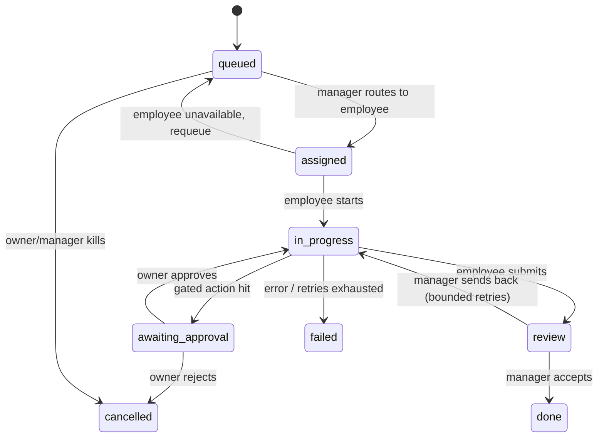

# Core data model

Storage-agnostic: every entity is a plain Python dataclass that round-trips to JSON
(`dataclasses.asdict` / `from_dict`). IDs are string ULIDs; timestamps are UTC ISO-8601
strings. References between entities are by ID, never nested objects — so the same
shapes work in memory, as JSON files on disk, or in any DB later. Employees are
Claude Agent SDK agents: `Employee.prompt` becomes the agent's system prompt and
`Employee.tools` its tool allowlist, so the model maps 1:1 onto `ClaudeAgentOptions`.

## Company

The single root config object (loaded from YAML, held as one dataclass).

| field | type | notes |
|---|---|---|
| `id` | `str` | ULID |
| `name` | `str` | |
| `goals` | `list[str]` | ordered, highest priority first |
| `constraints` | `list[str]` | hard rules injected into every employee prompt (budget, legal, tone) |
| `resources` | `dict[str, str]` | named handles: repo URL, domain, API-key *names* (never secret values) |
| `owner` | `str` | human owner contact (email/handle) — approval requests go here |
| `employees` | `list[str]` | Employee IDs on payroll |

## Employee

A role-scoped agent definition. Config, not runtime state (runtime = SDK session).

| field | type | notes |
|---|---|---|
| `id` | `str` | ULID |
| `name` | `str` | display name, e.g. "Eng-1" |
| `role` | `str` | routing key: `"engineer"`, `"marketer"`, `"ops"`, `"chief_of_staff"` |
| `job_description` | `str` | system prompt: mission, scope, quality bar, when to escalate |
| `tools` | `list[str]` | tool allowlist passed to the SDK (`"Bash"`, `"Write"`, MCP names…) |
| `approval_gates` | `list[str]` | action tags requiring owner sign-off, e.g. `"spend_money"`, `"send_external"`, `"deploy_prod"`, `"delete_data"` |
| `status` | `str` | `"active"` \| `"paused"` \| `"terminated"` ("fired" — kept for journal history) |
| `max_concurrent_tasks` | `int` | default 1 |

Decision: gates live on the *employee*, matched against a task's `gate_tags` — so the
same task is auto-approved for one role and gated for another (per-role trust levels).

## Task

| field | type | notes |
|---|---|---|
| `id` | `str` | ULID |
| `title` | `str` | one line |
| `description` | `str` | full brief incl. acceptance criteria |
| `source` | `str` | `"owner"` \| `"manager"` \| `"employee:<id>"` (spawned subtask) — accountability trail |
| `parent_id` | `str \| None` | for spawned subtasks |
| `assignee_role` | `str` | routed by role; manager binds a concrete employee |
| `assignee_id` | `str \| None` | set when claimed |
| `state` | `str` | see state machine |
| `priority` | `int` | 0 = urgent … 3 = backlog; FIFO within priority |
| `gate_tags` | `list[str]` | action tags this task may involve; intersect with employee's `approval_gates` ⇒ pause at `awaiting_approval` |
| `result` | `str \| None` | outcome summary on completion/failure |
| `created_at`, `updated_at` | `str` | ISO-8601 |

### State machine



Decisions: `awaiting_approval` is entered mid-flight (the agent pauses at the gated
action; it does not pre-clear gates), so approvals carry concrete context ("send
*this* email?") not hypotheticals. `review` is a manager step distinct from owner
approval — quality control vs. authority. Terminal states: `done`, `failed`, `cancelled`.
Every transition appends a Journal entry.

## JournalEntry

Append-only log; the audit substrate. One entry per meaningful action or transition.

| field | type | notes |
|---|---|---|
| `id` | `str` | ULID (sortable = chronological) |
| `employee_id` | `str` | who ("manager" and "owner" are reserved pseudo-IDs) |
| `task_id` | `str \| None` | what it was for (None for standups/hiring events) |
| `action` | `str` | verb tag: `"claimed"`, `"tool_call"`, `"decision"`, `"state_change"`, `"escalated"`, `"approved"`, `"rejected"`, `"completed"` |
| `summary` | `str` | one-line human-readable "what and why" |
| `evidence` | `list[dict]` | typed refs: `{"kind": "file" \| "url" \| "diff" \| "command_output" \| "message", "ref": str, "excerpt": str \| None}` |
| `timestamp` | `str` | ISO-8601 |

Decision: journals are the source of truth for "what happened"; task `state` is
derived-cachable from them. Never mutate or delete entries.

## StandupDigest

Generated periodically per company from journal entries in a window; what the owner reads.

| field | type | notes |
|---|---|---|
| `id` | `str` | ULID |
| `company_id` | `str` | |
| `period_start`, `period_end` | `str` | ISO-8601 window |
| `per_employee` | `list[dict]` | `{"employee_id", "done": [task ids], "in_progress": [...], "blocked": [...]}` |
| `pending_approvals` | `list[str]` | task IDs sitting in `awaiting_approval` — the owner's action list |
| `narrative` | `str` | LLM-written summary, grounded in cited journal entry IDs |
| `journal_entry_ids` | `list[str]` | entries covered — makes the digest auditable too |

## Relationships

```
Company 1—* Employee        (by id in company.employees)
Company 1—* Task            (implicit: one backlog per company)
Task    *—1 Employee        (assignee_id; routed via assignee_role)
Task    1—* Task            (parent_id, spawned subtasks)
JournalEntry *—1 Employee, *—0..1 Task
StandupDigest *—* JournalEntry (journal_entry_ids)
```
